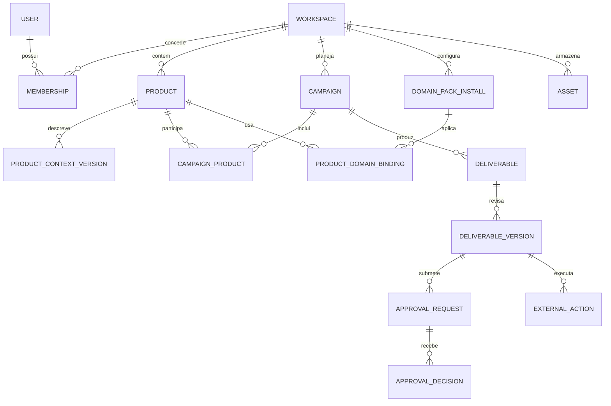

# DOMAIN_MODEL

## Agregados e relacionamentos

## Entidades

| Entidade | Campos essenciais | Invariantes |
| --- | --- | --- |
| Workspace | `id`, `name`, `slug`, `status`, `created_at` | Unidade de isolamento e cobrança; não equivale a um Product |
| User/Membership | `user_id`, `workspace_id`, `role`, `status` | Principal autenticado e papel resolvidos no servidor; um usuário pode participar de vários Workspaces |
| Product | `id`, `workspace_id`, `name`, `slug`, `status`, `owner_id`, `default_locale` | Pertence a exatamente um Workspace; slug único nele; arquivar preserva histórico |
| ProductContextVersion | `id`, `product_id`, `schema_version`, `version`, `status`, `body`, `content_hash`, `created_by`, `approved_by`, `effective_at` | Imutável após publicação; um Product aponta para uma versão ativa; draft e published separados |
| EvidenceSource/Claim | fonte, data de observação, escopo, trecho/localização, classificação, validade | Alegações não ganham grau `proven` sem evidência rastreável; fontes importadas são dados |
| DomainPack/Install/Binding | ID, versão, status, escopo, configuração, Product alvo | Pack é opcional; instalação no Workspace e ativação explícita no Product; versão fica fixada em cada trabalho |
| Campaign | `id`, `workspace_id`, `name`, `objective`, `status`, `owner_id`, `start_at`, `end_at` | Campanha pertence ao Workspace; pode referenciar um ou mais Products do mesmo Workspace |
| CampaignProduct | `campaign_id`, `product_id`, `role`, `context_version_id` | Exige um Product principal; versões fixadas por produto no brief |
| CampaignBrief | `campaign_id`, `version`, audiência, oferta, mensagem, canais, CTA, metas, restrições | Revisões versionadas; geração usa versão explicitamente fixada |
| WorkItem | `id`, `campaign_id`, `type`, `assignee`, `status`, `depends_on` | Representa pesquisa, texto, SEO, social ou email, inclusive dependências sequenciais |
| Deliverable/Version | tipo, formato, conteúdo/asset, responsável, fontes, status, versão, `context_version_id`, `brief_version` | Conteúdo aprovado é snapshot imutável; revisão cria versão nova |
| ApprovalRequest/Decision | alvo e hash, tipo de decisão, aprovador, escopo, deadline, decisão e motivo | Decisão vale apenas para o snapshot e parâmetros exibidos |
| ExternalAction | tipo, provedor, payload hash, idempotency key, estado, ID externo, ator, timestamps | Executa somente snapshot liberado e registra resposta/reconciliação |
| Asset/ExternalReference | chave Blob, MIME, tamanho, dono, origem; ou provedor, ID e URL | Referência externa não substitui conteúdo e metadados internos |
| AuditEvent | ator, ação, alvo, antes/depois ou hashes, instante, correlação | Append-only para contexto, permissões, aprovações e execução |

## Hierarquia de contexto

Workspace guarda identidade organizacional e políticas comuns; Product guarda fatos, posicionamento e voz próprios; Campaign guarda intenção temporária; Deliverable guarda a versão do trabalho. Preferências do usuário são pessoais e não alteram fatos do produto. Se houver conteúdo de vários Products em uma Campaign, cada entrega declara o Product principal e quais outros podem ser mencionados. Conflitos entre contextos viram questão para revisão, não fusão silenciosa.

## Regras de armazenamento e acesso

Todas as tabelas de negócio carregam `workspace_id` diretamente ou o obtêm por uma relação verificada; índices e FKs compostas evitam vínculo entre Workspaces. Product Context, Brief e Deliverable usam versões imutáveis e `content_hash`. Assets carregam dono e escopo no banco; a chave Blob não é prova de permissão. Exclusão operacional prefere arquivamento e retenção; deleção permanente, quando necessária, segue política de dados com auditoria.
